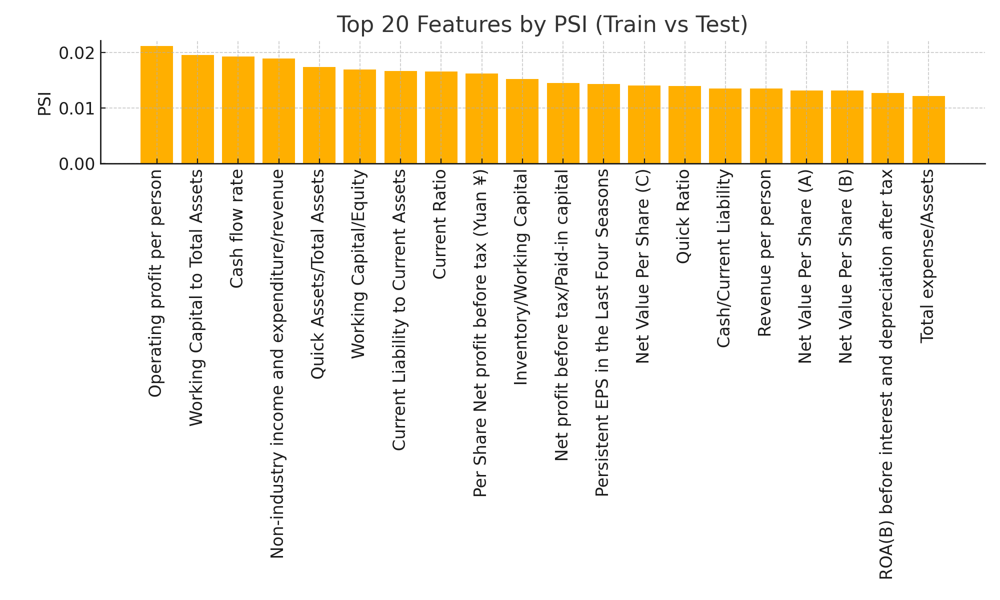

# Lab 4 — Company Bankruptcy Prediction (Binary Classification) 🏢💸

This document outlines the comprehensive approach and decision framework for building a binary classification model to predict company bankruptcy.

---

## Table of Contents 📋

1. [🤖 Choosing the Initial Models](#1-choosing-the-initial-models)
2. [🔧 Data Pre-processing](#2-data-pre-processing)
3. [⚖️ Handling Class Imbalance](#3-handling-class-imbalance)
4. [📊 Outlier Detection and Treatment](#4-outlier-detection-and-treatment)
5. [🎯 Addressing Sampling Bias](#5-addressing-sampling-bias-traintest)
6. [📏 Data Normalization](#6-data-normalization)
7. [📈 Testing for Normality](#7-testing-for-normality)
8. [🔍 Dimensionality Reduction (PCA)](#8-dimensionality-reduction-pca)
9. [⚙️ Feature Engineering Choices](#9-feature-engineering-choices)
10. [🔗 Testing & Addressing Multicollinearity](#10-testing--addressing-multicollinearity)
11. [✨ Feature Selection Methods](#11-feature-selection-methods)
12. [🎛️ Hyperparameter Tuning Methods](#12-hyperparameter-tuning-methods)
13. [🔄 Cross-Validation Strategy](#13-cross-validation-strategy)
14. [📊 Evaluation Metrics Selection](#14-evaluation-metrics-selection)
15. [📉 Evaluating Drift & Model Degradation](#15-evaluating-drift--model-degradation)
16. [🔍 Interpreting Results & Explainability](#16-interpreting-results--explainability)

---

## 1) 🤖 Choosing the Initial Models

### 🎯 Research and Model Selection
**Selected Models:** Logistic Regression (benchmark), Random Forest, and XGBoost for non-linear patterns

**Rationale:** Skip CatBoost since features are numeric, not categorical

### 🚀 Implementation Strategy
**Approach:** Start simple (LogReg) to set a clear baseline, then test RF/XGBoost

**Why:** Avoids overfitting early and demonstrates if complexity actually adds value

### 🤔 Alternative Approaches Considered

#### 🔄 Unsupervised Clustering
**Decision:** No ❌

**Justification:** We have labels and a clear target; clustering won't optimize bankruptcy risk directly. Supervised models align with the objective function.

#### 📊 Logistic Regression as Benchmark
**Decision:** Yes ✅

**Justification:** It's transparent, fast to train, and easy to explain. Provides a regulatory-friendly baseline to beat.

---

## 2) 🔧 Data Pre-processing

### ⚙️ Model-Specific Processing
**Approach:** Process data differently by model

**Implementation:** Scale only for Logistic Regression; leave trees unscaled

**Rationale:** Tree splits depend on rank/order, not magnitude

### 📏 Normalization and Standardization
**For Logistic Regression:** StandardScaler (not MinMaxScaler) 📊
**For Tree Models:** No scaling needed 🌳
**Encoding:** None required (all numeric features) 🔢

**Why:** Improves LR stability without unnecessary transforms

### 🔄 Processing Pipeline
**Strategy:** Fit imputer/scaler on training data only, then apply to validation/test sets

---

## 3) ⚖️ Handling Class Imbalance

### 📊 Class Distribution Analysis
**Observation:** Yes, there is significant class imbalance ⚠️

**Details:** Bankruptcies are rare (~3% of cases)

**Impact:** Accuracy alone is misleading; we need recall-aware metrics

### 🛠️ Imbalance Handling Techniques

#### ⚖️ Comparison of Methods
- **Class Weights:** Keep real data (low risk) ✅
- **SMOTE:** May overfit noise ⚠️
- **Undersampling:** Loses signal ❌

**Chosen Approach:** Prefer class weights, use SMOTE sparingly in training folds only

### ⚖️ Weight Adjustment Strategy
**Implementation:** 
- Use `class_weight` parameter (Logistic Regression) 📊
- Use `scale_pos_weight` parameter (XGBoost) 🌲

**Rationale:** Shifts the decision boundary toward the rare class

### 📋 Stratification Decision
**Approach:** Use stratified split/cross-validation ✅

**Justification:** Preserves base rate across folds for fair validation

---

## 4) Outlier Detection and Treatment

### Impact Assessment on Minority Class
**Consideration:** Outliers can be true distress signals

**Risk:** Removing them can erase the target pattern we're trying to detect

### Treatment Approach
**Strategy:** 
- Fix clear data errors
- Apply mild winsorization for Logistic Regression only
- Keep raw values for tree models

**Rationale:** Stabilize LR while preserving risk cues that trees can naturally handle

---

## 5) Addressing Sampling Bias (train/test)

### Distribution Comparison Methods
**Tools:** Population Stability Index (PSI) per feature, correlation analysis

**Purpose:** Detect population shift that can invalidate validation results

### Implementation Strategy
**Process:** 
1. Compute PSI for each feature
2. Check key correlations between train/test
3. Re-split or apply time-split if significant drift detected

**Importance:** Ensures train/test represent the same underlying population, preventing optimistic or pessimistic model estimates

---

## 6) Data Normalization

### Model-Specific Normalization
**Logistic Regression:** Apply StandardScaler
**Tree Models:** No normalization needed

**Reasoning:** LR benefits from equal scales; trees are scale-invariant due to different underlying mathematics

### Implementation Approach
**Strategy:** Standardize LR features and store scaler for inference

**Benefits:** Ensures reproducible, stable coefficients

---

## 7) Testing for Normality

### Normality Requirements
**Assessment:** Not required for this problem

**Details:**
- RF/XGBoost don't require normal distributions
- Logistic Regression doesn't need normal features, just linear log-odds relationships

**Approach:** Avoid over-processing to maintain model interpretability

### Addressing Extreme Skewness
**Strategy:** If extreme skew hurts LR performance, apply log-transform to a few ratios (training data only)

**Benefit:** Improves linearity and model calibration

---

## 8) Dimensionality Reduction (PCA)

### PCA Decision
**Approach:** No PCA applied

**Rationale:** Keep native financial ratios for interpretability

### Trade-off Analysis
**Pros of PCA:** Less noise, reduced overfitting risk
**Cons of PCA:** Loses meaning of financial ratios

**Conclusion:** Tree models already manage many features effectively; interpretability beats marginal performance gains

---

## 9) Feature Engineering Choices

### Additional Feature Creation
**Approach:** Add only simple flags (e.g., negative ratio indicators) if clearly helpful

**Rationale:** Achieve small performance boosts without adding complexity

### Dataset Sufficiency
**Assessment:** Current dataset is sufficient for baseline modeling

**Strategy:** Avoid speculative feature combinations to reduce overfitting risk and maintain simple explanations

---

## 10) Testing & Addressing Multicollinearity

### Detection Methods
**Tools:** 
- Correlation matrix analysis
- Variance Inflation Factor (VIF) for Logistic Regression

**Purpose:** Identify unstable feature groups

### Impact and Solutions
**Problem:** Collinearity destabilizes LR coefficients; tree models tolerate it naturally

**Solution:** Use regularization and drop only near-duplicate features

---

## 11) Feature Selection Methods

### Selected Methods
**Approach:** Combination of multiple techniques:
- Correlation filtering
- L1 regularization (Logistic Regression)
- XGBoost feature importance

**Rationale:** Provides both model-agnostic and model-based perspectives

### Feature Count Considerations
**Risks:**
- Too many features → increased variance and noise
- Too few features → miss weak but important signals

**Strategy:** Maintain a compact, consistently ranked set across all folds

### Implementation Approach
**Process:** Drop near-duplicates, keep features consistently ranked as important

**Benefits:** Improves generalization and model readability

---

## 12) Hyperparameter Tuning Methods

### Chosen Method
**Approach:** Randomized Search with early stopping (XGBoost)

**Rationale:** Delivers strong results per unit of compute time; avoids exhaustive grid searches

### Tuning Parameters
**Focus Areas:**
- Tree depth
- Learning rate
- Subsampling rates
- Class weights

---

## 13) Cross-Validation Strategy

### CV Method Selection
**Approach:** Stratified K-fold (5-10 folds)

**Rationale:** Preserves class base rate in each fold for fair validation

### Special Considerations
**Time-ordered Data:** Use time-split if temporal order exists
**Preprocessing:** Always fit preprocessing within folds to prevent data leakage

---

## 14) Evaluation Metrics Selection

### Prediction Method
**Approach:** Use `predict_proba()` and choose optimal threshold

**Rationale:** Supports cost-sensitive decision making

### Primary Metrics
**Selected Metrics:**
- **Primary:** PR-AUC (optimized for rare class)
- **Secondary:** ROC-AUC, F1-score at chosen threshold
- **Calibration:** Brier score

**Trade-off Balance:** Ranking quality, threshold optimization, and probability reliability

---

## 15) Evaluating Drift & Model Degradation

### Monitoring Methods
**Tools:** Population Stability Index (PSI) over time/batches, performance tracking

**Importance:** Provides early warning before production failures

### Implementation Strategy
**Process:** 
1. Calculate PSI on train vs test split
2. Validate data representativeness
3. Catch bias from unlucky splits
4. Guide re-splitting or reweighting decisions

---

## 16) Interpreting Results & Explainability

### Model-Specific Explainability Methods
**XGBoost:** SHAP values (global and local explanations)
**Random Forest:** Permutation importance
**Logistic Regression:** Coefficient analysis

**Rationale:** Provides clear, case-level reasoning for regulators and business stakeholders

### Implementation Focus
**Goal:** Ensure model decisions can be explained and justified for regulatory compliance and business acceptance

---

## Summary

This comprehensive approach balances model performance with interpretability, regulatory requirements, and practical implementation considerations. The methodology prioritizes robust validation, proper handling of class imbalance, and maintains explainability throughout the modeling process.